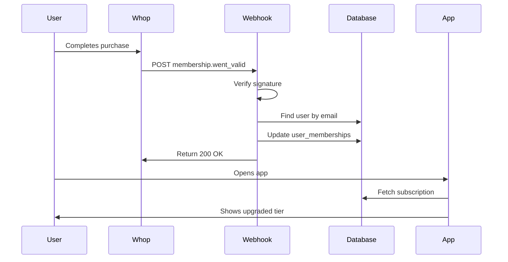

# Whop Webhook Integration Setup Guide

## ✅ What's Already Implemented

Your Whop webhook integration is **fully implemented** and ready to use! Here's what you have:

### Backend (Supabase Edge Function)
- ✅ Webhook endpoint at `supabase/functions/whop-webhook/index.ts`
- ✅ Signature verification for security
- ✅ Handles membership activation, deactivation, and payment events
- ✅ Automatically syncs tier to `user_memberships` table
- ✅ Maps Whop product IDs to your tiers (challenge, diy, elite, free)

### Frontend Components
- ✅ `useSubscriptionTier` hook - Fetches user's current subscription
- ✅ `SubscriptionStatusCard` component - Displays subscription info with refresh button
- ✅ Integrated into Profile page

### Database
- ✅ `user_memberships` table with all necessary fields
- ✅ RLS policies for secure access
- ✅ Whop user ID tracking

---

## 🚀 Setup Instructions

### Step 1: Get Your Webhook URL

Your webhook URL is:
```
https://goiwiofbmszghvyvhyll.supabase.co/functions/v1/whop-webhook
```

### Step 2: Configure Webhook in Whop Dashboard

1. Go to [Whop Dashboard](https://dash.whop.com/)
2. Navigate to **Settings** → **Developers** → **Webhooks**
3. Click **Add Webhook Endpoint**
4. Enter your webhook URL (from Step 1)
5. Select these events to subscribe to:
   - ✅ `membership.went_valid` - When user purchases
   - ✅ `membership.went_invalid` - When subscription expires/cancels
   - ✅ `payment.succeeded` - When payment is successful
   - ✅ `payment.failed` - When payment fails

6. Click **Create**
7. **Copy the Signing Secret** (starts with `whsec_...`)

### Step 3: Add Webhook Secret to Lovable

1. In your Lovable project, click **Backend** (database icon in top-right)
2. Go to **Edge Functions** → **whop-webhook**
3. Click on **Secrets** or **Environment Variables**
4. Add a new secret:
   - Name: `WHOP_WEBHOOK_SECRET`
   - Value: The signing secret from Step 2 (e.g., `whsec_abc123...`)

Alternatively, if Lovable doesn't show this UI, you can set it via Supabase CLI or contact Lovable support to add the secret.

### Step 4: Update Product ID Mapping

The webhook currently maps these Whop product IDs to tiers:

```typescript
// In supabase/functions/whop-webhook/index.ts

const planMapping = {
  // Challenge (7-Day)
  '297-b6': 'challenge',
  
  // DIY Platform
  'diy-annual': 'diy',
  
  // Elite Transformation
  'elite-90-day-transformation': 'elite',
  
  // Free tier
  'hits-free': 'free',
};
```

**To find your actual Whop product IDs:**

1. Go to [Whop Dashboard](https://dash.whop.com/) → **Products**
2. Click on each product
3. Copy the product ID from the URL or product settings
4. Update the `mapPlanToTier` function in `supabase/functions/whop-webhook/index.ts`

Example:
```typescript
const planMapping: Record<string, string> = {
  'prod_ABC123': 'challenge',     // Replace with your actual product ID
  'prod_XYZ789': 'diy',           // Replace with your actual product ID
  'prod_DEF456': 'elite',         // Replace with your actual product ID
};
```

---

## 🧪 Testing the Integration

### Test 1: Manual Webhook Test (Using Whop Dashboard)

1. Go to Whop Dashboard → **Developers** → **Webhooks**
2. Find your webhook endpoint
3. Click **Send Test Event**
4. Select event type: `membership.went_valid`
5. Click **Send**
6. Check the **Response** tab to verify it returned `200 OK`

### Test 2: Real Purchase Test

1. Create a test product in Whop (or use existing)
2. Set up a $0 test price or use Whop's test mode
3. Make a test purchase
4. Check your Supabase logs:
   - Go to Backend → Edge Functions → whop-webhook → Logs
   - You should see: `[Whop] Webhook received: membership.went_valid`
5. Verify the database:
   - Go to Backend → Database → user_memberships
   - Confirm the user's tier was updated

### Test 3: Frontend Refresh

1. Log in to your app
2. Go to Profile page
3. Click the **Refresh** button on the Subscription Status card
4. Verify your tier displays correctly

---

## 🔍 Monitoring & Debugging

### Viewing Webhook Logs

**In Whop Dashboard:**
- Go to Webhooks → Click your endpoint → **Events** tab
- Shows all webhook attempts, responses, and errors

**In Lovable/Supabase:**
- Click Backend → Edge Functions → whop-webhook → Logs
- Shows server-side processing logs

### Common Issues & Solutions

#### Issue: Webhook returns 401 Invalid Signature
**Solution:** Verify `WHOP_WEBHOOK_SECRET` matches the signing secret in Whop dashboard

#### Issue: User tier not updating
**Possible causes:**
1. User email doesn't match between Whop and your app
2. Product ID not in the `planMapping` - Check logs for warnings
3. User not in `user_memberships` table yet - They need to log in at least once

**Solution:** Check edge function logs for errors

#### Issue: Product ID defaulting to 'free' tier
**Solution:** Add your actual Whop product ID to the `mapPlanToTier` function

---

## 📊 How It Works

### User Purchase Flow



### Database Structure

The webhook updates the `user_memberships` table:

| Field | Description |
|-------|-------------|
| `user_id` | Your app's user ID |
| `tier` | Membership tier (free, challenge, diy, elite) |
| `status` | Subscription status (active, cancelled) |
| `whop_user_id` | Whop's user ID |
| `whop_membership_id` | Whop's membership ID |
| `expires_at` | Expiration date (for challenge tier) |
| `swing_count` | Number of swings used |

---

## 🎯 Feature Gating

The `useSubscriptionTier` hook provides feature flags based on tier:

```typescript
const { subscription } = useSubscriptionTier();

// Check features
if (subscription.features.unlimitedAnalyses) {
  // Allow unlimited swings
}

if (subscription.features.coachRickAI) {
  // Show Coach Rick chat
}

// Check swing limit for free/challenge tiers
if (subscription.swingCount >= subscription.features.swingsAllowed) {
  // Show upgrade prompt
}
```

### Feature Matrix

| Feature | Free | Challenge | DIY | Elite |
|---------|------|-----------|-----|-------|
| Swing Analyses | 10 | 50 | ♾️ | ♾️ |
| Coach Rick AI | ❌ | ✅ | ✅ | ✅ |
| Drill Plans | ❌ | ✅ | ✅ | ✅ |
| Advanced Reports | ❌ | ❌ | ✅ | ✅ |
| Live Coaching | ❌ | ✅ | ❌ | ✅ |

---

## 🔐 Security Notes

- ✅ Webhook signature verification enabled
- ✅ Using Supabase service role key (bypasses RLS for webhook operations)
- ✅ RLS policies protect user data access
- ✅ Webhook secret stored in secure environment variables

---

## 📞 Support

If you encounter issues:

1. **Check Logs**
   - Whop Dashboard → Webhooks → Events
   - Lovable Backend → Edge Functions → whop-webhook → Logs

2. **Common Solutions**
   - Verify webhook URL is correct
   - Confirm webhook secret matches
   - Check product ID mapping

3. **Test with curl**
   ```bash
   curl -X POST https://goiwiofbmszghvyvhyll.supabase.co/functions/v1/whop-webhook \
     -H "Content-Type: application/json" \
     -H "x-whop-signature: YOUR_SECRET" \
     -d '{
       "action": "membership.went_valid",
       "data": {
         "user": {"email": "test@example.com"},
         "product": {"id": "diy-annual"},
         "status": "active"
       }
     }'
   ```

---

## ✅ Checklist

Before going live, verify:

- [ ] Webhook URL added to Whop dashboard
- [ ] Subscribed to all 4 event types
- [ ] `WHOP_WEBHOOK_SECRET` configured in Lovable
- [ ] Product IDs mapped correctly in `mapPlanToTier`
- [ ] Test purchase completed successfully
- [ ] User tier updated in database
- [ ] Frontend displays correct tier
- [ ] Logs show no errors

---

## 🎉 You're All Set!

Your Whop webhook integration is ready. Users can now:
1. Purchase subscriptions through Whop
2. Have their tier automatically synced
3. Access features immediately (no manual activation needed)
4. Use the "Refresh Subscription" button if needed

The webhook runs automatically in the background and keeps your app in sync with Whop!
